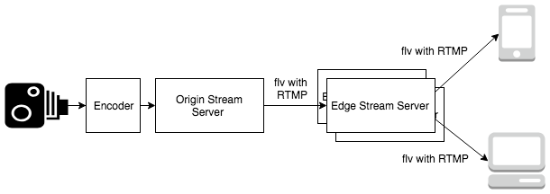
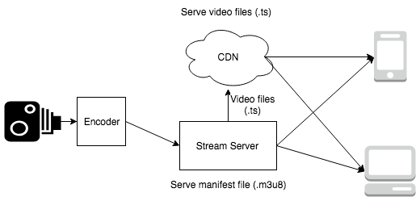
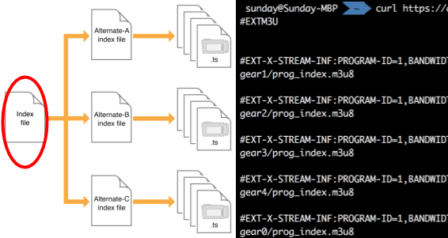
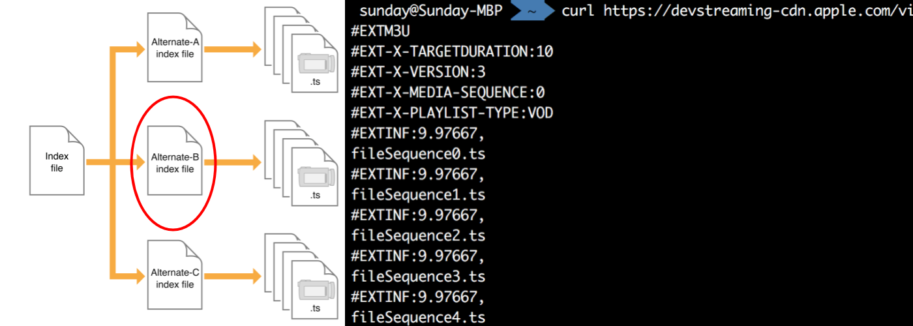
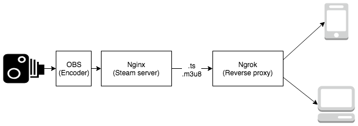

# Video.js with HLS

Opensource HTML5 video player with HTTP Live Streaming

##### Sunday Ku

+++

- Software Engineer in HK01
    - Rebuild HK01 web video player with videojs
    - Focus on backend role now

+++

# Agenda

- Live streaming introduction
- RTMP?
- HTTP Live Streaming
- Video.js
- Demonstration

+++

# Context

- Focus on video delivery
- Focus on browsers

Note:

- Will not mention detail of video recording, compression
- Will not discuss desktop and mobile apps

---

## Terms

- Encode
    - Convert raw video to "portable" video format
- Transcode
    - Convert video from a format to another

Note:

- Encode / Transcode: It may change the quality
- Encode ~= compile, convert raw video to some format can be played by common players
- Transcode ~= transpile, translate from one format to another

+++

## Live streaming architecture

Note:

- Can use different coding in upstream and downstream
    - Stream server need to transcode if different coding is used
- We focus on the section of Stream servers and Clients

---

# RTMP?

- Real-Time Messaging Protocol
- It is one of the most popular protocol for streaming

Note:

We will introduce RTMP streaming architecture and the weaknesses of RTMP

+++

## RTMP streaming architecture

Note:

- Orgin stream server: "Seed" of the video delivery
- Edge stream server: Repeater of the origin stream server
    - Edge stream server ~= content delievery network
- Require adobe flash player to play video in flv format

+++

## Weaknesses of RTMP streaming

- Flash is fading out
- RTMP is not using 80/443 port
- Edge servers are expensive

Note:

- We cannot use Adobe flash player
- Not using 80/443 port is critical problem.
    - It use 1935 port
    - As we cannot create TCP socket in browser, we cannot get resource with browser only.
        - No HTML player support RTMP streaming
    - RTMP works well in mobile and desktop apps

HLS can solve the above problems

---

# What is HTTP Live Streaming?

- Support by modern browsers
- HTTP(S) based
- Media can be served by Content Delivery Network (CDN)
- Built-in adaptive bitrate

Note:

- Support natively or with media source extension API
    - Apple's products have native support on this protocol
    - MSE support: https://caniuse.com/#search=mse
- HTTP(S) based means
    - We can use 80/443 port to get all resources
    - The protocol is stateless where RTMP isn't
- CDN is much cheaper than Edge servers
- Will not cover ABR if don't have time

+++

## HLS architecture

Note:

- How HLS works
    - RTMP feeding clients with a continuous stream of video fragments
    - HLS give clients a list of video fragments, client get it one by one
- CDN serve large video files
- Streaming server serve small manifest file
    - manifest file is pointer to video files

+++

## HLS manifest files

##### m3u8 playlist

Note:

- Entry point of HLS
- m3u8 playlist contains a list of streams
- Adaptive bitrate implement by automatically switch on these streams

+++

## HLS manifest files

##### m3u8 stream

Note:

- Each m3u8 stream contains a list of video fregments (.ts file)
- Streaming server will continuously update these files

---?image=images/videojs6.png

Note:

- Open-source HTML5 player with large community
- Good browser support (include IE)
    - Use flash to polyfill HTML5 video API for old IEs
- Configurable Player
    - Customize skin
    - Customize component
    - Customize player technology
        - If you invert a new video format, you can implement a multiplexer to support your own video format in Video.js
- Plugin structure
    - You can publish a video.js plugin to share your custom skin / feature
    - Provide a better way to organize your customization

---

# Demonstration

## Live streaming

Note:

1. Show the demo infrastructure
    - We don't have CDN
    - We have a reverse proxy for public access
2. Demo
    - OBS
        - Encoder
        - How to config OBS
    - Nginx with rtmp module in docker
        - Stream server
        - Show docker file
        - Show nginx config file
        - Show the command build and run the nginx
    - Video js & browser
        - Client
        - Can show the code later
    - ngrok
        - Reverse proxy for public network access the local stream
    - Let audience access the player through QR code scanner