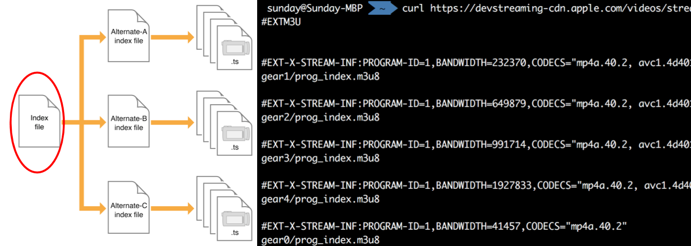

# Video.js with HLS

HTTP Live Streaming with Opensource HTML5 video player

##### Sunday Ku

+++

# Agenda

- Live streaming introduction
- What's wrong with RTMP?
- HTTP Live Streaming
- The HTML5 player framework - Video.js
- Customizing Video.js
- Demonstration

+++

# Context

- Focus on video delivery
- Focus on desktop and mobile web client
- Demo with code open-sourced
    - Will not have code walkthrough

Note:

Will not mention detail of video recording, encoding nor transcoding
Will not discuss desktop and mobile apps
Don't have enough time, read the demo code yourself

---

# Live streaming introduction

- Live streaming terminlogy
- Live streaming architecture

+++

## Live streaming terminlogy

- Live streaming: Simultaneously record and broadcast video
- Encode / Transcode: Convert video to other video file formats
- Bit rate: Size of the data stream when the video is playing

Note:

Encode / Transcode: It may change the quality
Encode ~= compile, convert raw video to some format can be played by common players
Transcode ~= transpile, translate from one format to another
Bit rate ~= video quality, units: kbps / mbps

+++

## Live streaming terminlogy

- Orgin stream server: "Seed" of the video delivery
- Edge stream server: Repeater of the origin stream server

Note:

Edge stream server ~= content delievery network

+++

## Live streaming architecture

Note:

We can use any encoding between recorder and stream server, as long as your stream server support it
We focus on the section of Stream servers and Clients

---

# What's wrong with RTMP?

- RTMP streaming architecture
- Drawbacks of RTMP streaming

+++

## RTMP streaming architecture

#### Real-Time Messaging Protocol

Note:

Require adobe flash player to play video in flv format

+++

## Drawbacks of RTMP streaming

- Flash is fading out
- RTMP is not using 80/443 port
- Edge servers are expensive

Note:

- We cannot use Adobe flash player
- Not using 80/443 port is critical problem.
    - As we cannot create TCP socket in browser, we cannot get resource with browser only.
        - No HTML player support RTMP streaming
    - RTMP works well in mobile and desktop apps

HLS can solve the above problems

---

# What is HTTP Live Streaming?

- Support by modern browsers
- HTTP(S) based
- Media can be served by Content Delivery Network (CDN)
- Built-in adaptive bitrate

Note:

- Support natively or with media source extension API
    - Apple's products have native support on this protocol
    - MSE support: https://caniuse.com/#search=mse
- HTTP(S) based means
    - We can use 80/443 port to get all resources
    - The protocol is stateless where RTMP isn't
- CDN is much cheaper than Edge servers
- Will not cover ABR if don't have time

+++

## HLS architecture

Note:

- How HLS works
    - RTMP feeding clients with a continuous stream of video fragments
    - HLS give clients a list of video fragments, client get it one by one
- CDN serve large video files
- Streaming server serve small manifest file
    - manifest file is pointer to video files

+++

## HLS manifest files (m3u8 playlist)

Note:

- Entry point of HLS
- m3u8 playlist contains a list of streams
- Adaptive bitrate implement by automatically switch on these streams

+++

## HLS manifest files (m3u8 stream)

Note:

- Each m3u8 stream contains a list of video fregments (.ts file)
- Streaming server will continuously update these files

---

# The HTML5 player framework - Video.js

Note:

- what is it
- player structure
- browser support

---

# Customizing Video.js

Notes:

- UI components
- module
- multiplexing

---

# Demonstration

Notes:

OBS -> nginx-rtmp -> ngrok -> Github page player