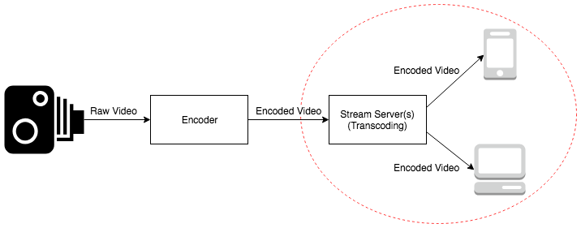

# Video.js with HLS

HTTP Live Streaming with Opensource HTML5 video player

##### Sunday Ku

+++

# Agenda

- Live streaming introduction
- What is HTTP Live Streaming?
- The HTML5 player framework - Video.js
- Customizing Video.js
- Demonstration

---

## Live streaming introduction (terminlogy)

Live streaming: Simultaneously record and broadcast video

Encode / Transcode: Convert video to other video file formats

Bit rate: Size of the data stream when the video is playing

Note:

Encode / Transcode: It may change the quality
Encode ~= compile, convert raw video to some format can be played by common players
Transcode ~= transpile, translate from one format to another
Bit rate ~= video quality, units: kbps / mbps

+++

## Live streaming introduction (terminlogy)

Orgin stream server: "Seed" of the video delivery

Edge stream server: Repeater of the origin stream server

Note:

Edge stream server ~= content delievery network

+++

## Live streaming introduction (data flow)

Note:

We focus on the section of Stream servers and Clients

+++

## RTMP

Recorder --(raw file)--> encoder --(encoded file)--> Origin stream server --(flv with RTMP)--> Edge stream servers --(flv with RTMP)--> Adobe Flash Player

+++

## Drawback of RTMP streaming

- Flash is fading out
- RTMP is not using 80/443 port
- Require lots of edge servers

Note:

HLS can solve the above problems
Not using 80/443 port is critical problem. As we cannot create TCP socket in browser, we cannot get resource with browser only.
Edge servers -> expensive
---

# What is HTTP Live Streaming?

- Designed and implemented by Apple
- HTTP(S) based
- Media can be served by Content Delivery Network

Note:

Apple's products have native support on this protocol
We can use 80/443 port to get all resources

Mentions browser support in somewhere?

+++

Recorder --(raw file)--> encoder --(encoded file)--> Stream server --(Manifest file)--> HTML5 player with HLS support
                                                       |--(encoded media files)--> CDN --(encoded media files)--^

---

# The HTML5 player framework - Video.js

Notes:

- what is it
- player structure
- browser support

---

# Customizing Video.js

Notes:

- UI components
- module
- multiplexing

---

# Demonstration

Notes:

OBS -> nginx-rtmp -> ngrok -> Github page player